# 🚀 Configuración de CI/CD con GitHub Actions

Este proyecto utiliza GitHub Actions para CI/CD automático que:
- ✅ Construye y prueba el código
- ✅ Crea imágenes Docker
- ✅ Sube las imágenes a Docker Hub
- ✅ Despliega automáticamente en el servidor de producción

## 📋 Prerequisitos

1. **Cuenta de Docker Hub** (gratuita)
   - Crear en: https://hub.docker.com/signup

2. **Repositorio en GitHub**
   - El código debe estar en GitHub

3. **Servidor configurado**
   - IP: 64.176.16.195
   - Docker instalado
   - SSH habilitado

---

## 🔧 Paso 1: Configurar Docker Hub

### 1.1 Crear cuenta en Docker Hub
```
URL: https://hub.docker.com/signup
Usuario: tu_usuario (ejemplo: mignaciacobo)
```

### 1.2 Crear Access Token
1. Ir a: https://hub.docker.com/settings/security
2. Click en **"New Access Token"**
3. Nombre: `GitHub Actions`
4. Permisos: **Read, Write, Delete**
5. Copiar el token (solo se muestra una vez)

### 1.3 Crear repositorios (opcional, se crean automáticamente)
- `tu_usuario/proyectosti-backend`
- `tu_usuario/proyectosti-frontend`

---

## 🔐 Paso 2: Configurar Secrets en GitHub

Ve a tu repositorio en GitHub:
```
Settings > Secrets and variables > Actions > New repository secret
```

### Secrets requeridos:

#### Docker Hub:
```
DOCKER_USERNAME
Valor: tu_usuario_dockerhub (ejemplo: mignaciacobo)

DOCKER_PASSWORD
Valor: el_access_token_que_copiaste
```

#### Servidor:
```
SERVER_HOST
Valor: 64.176.16.195

SERVER_USER
Valor: root

SERVER_PASSWORD
Valor: J4c#[Ga2.D5oTxMt
```

#### Base de Datos:
```
DB_USER
Valor: postgres

DB_PASSWORD
Valor: genera_una_contraseña_segura (usa: openssl rand -base64 32)

DB_NAME
Valor: proyectosti
```

#### JWT:
```
JWT_SECRET
Valor: genera_un_secret_largo (usa: openssl rand -base64 64)
```

#### Email (SMTP):
```
SMTP_HOST
Valor: smtp.gmail.com

SMTP_PORT
Valor: 587

SMTP_USER
Valor: ma.cobo@profesor.duoc.cl

SMTP_PASS
Valor: tu_contraseña_de_aplicacion_gmail_16_caracteres
Crear en: https://myaccount.google.com/apppasswords

ADMIN_EMAIL
Valor: ma.cobo@profesor.duoc.cl
```

---

## 📝 Paso 3: Generar contraseñas seguras

### En PowerShell (Windows):
```powershell
# Generar DB_PASSWORD
$bytes = New-Object byte[] 32
[System.Security.Cryptography.RandomNumberGenerator]::Fill($bytes)
[Convert]::ToBase64String($bytes)

# Generar JWT_SECRET
$bytes = New-Object byte[] 64
[System.Security.Cryptography.RandomNumberGenerator]::Fill($bytes)
[Convert]::ToBase64String($bytes)
```

### En Linux/Mac:
```bash
# Generar DB_PASSWORD
openssl rand -base64 32

# Generar JWT_SECRET
openssl rand -base64 64
```

---

## 🎯 Paso 4: Configurar el .env local

Actualiza tu archivo `.env` local con tu usuario de Docker Hub:

```env
# Docker Hub
DOCKER_USERNAME=tu_usuario_dockerhub

# Las demás variables...
```

---

## 🚀 Paso 5: Hacer Push y Activar CI/CD

### Primera vez:

```powershell
# 1. Hacer commit de los cambios
git add .
git commit -m "feat: Configurar CI/CD con GitHub Actions"

# 2. Push a GitHub
git push origin main
```

### El workflow se ejecutará automáticamente:

1. **Build and Test** (2-3 min)
   - Instala dependencias
   - Ejecuta linters
   - Corre tests

2. **Build and Push** (5-7 min)
   - Construye imágenes Docker
   - Las sube a Docker Hub

3. **Deploy** (2-3 min)
   - Conecta al servidor
   - Descarga nuevas imágenes
   - Reinicia contenedores

**Tiempo total: ~10-15 minutos**

---

## 📊 Paso 6: Monitorear el Deployment

### En GitHub:
1. Ve a tu repositorio
2. Click en **"Actions"**
3. Verás el workflow ejecutándose
4. Click en el workflow para ver detalles

### En el servidor:
```bash
# Conectarse al servidor
ssh root@64.176.16.195

# Ver estado de contenedores
cd /var/www/proyectostivalpo
docker compose ps

# Ver logs
docker compose logs -f

# Ver imágenes descargadas
docker images
```

---

## 🔄 Workflow de Desarrollo

### Para cada cambio:

```powershell
# 1. Hacer cambios en el código
# 2. Probar localmente
docker compose -f docker-compose.dev.yml up -d

# 3. Commit y push
git add .
git commit -m "feat: descripción del cambio"
git push origin main

# 4. GitHub Actions despliega automáticamente
# 5. Verificar en https://proyectostivalpo.com
```

---

## 🛠️ Comandos Útiles

### Ver logs del workflow en GitHub:
```
Repositorio > Actions > Workflow reciente > Detalles
```

### Cancelar un deployment:
```
Repositorio > Actions > Workflow en ejecución > Cancel workflow
```

### Re-ejecutar un deployment fallido:
```
Repositorio > Actions > Workflow fallido > Re-run jobs
```

### Ver imágenes en Docker Hub:
```
https://hub.docker.com/u/tu_usuario
```

---

## 🐛 Solución de Problemas

### Error: "Invalid username or password"
```
Verifica:
1. DOCKER_USERNAME esté correcto en GitHub Secrets
2. DOCKER_PASSWORD sea el Access Token (no tu contraseña)
3. El token tenga permisos Read, Write, Delete
```

### Error: "Failed to connect to server"
```
Verifica:
1. SERVER_HOST = 64.176.16.195
2. SERVER_USER = root
3. SERVER_PASSWORD correcta
4. El servidor esté encendido
5. Puerto 22 (SSH) esté abierto
```

### Error: "docker compose command not found"
```
En el servidor:
sudo apt-get update
sudo apt-get install docker-compose-plugin -y
```

### El deployment se ejecuta pero el sitio no actualiza
```
En el servidor:
cd /var/www/proyectostivalpo
docker compose down
docker image prune -af
docker compose pull
docker compose up -d
```

### Ver por qué falló un deployment:
```bash
# En el servidor
cd /var/www/proyectostivalpo
docker compose logs backend
docker compose logs frontend
```

---

## 📈 Optimizaciones

### Cache de Docker Layers
Ya está configurado en el workflow para:
- ✅ Reducir tiempo de build
- ✅ Ahorrar ancho de banda
- ✅ Usar registry cache

### Solo desplegar en main
El workflow solo despliega cuando:
```yaml
if: github.ref == 'refs/heads/main'
```

Para otras ramas, solo ejecuta tests.

---

## 🎓 Flujo Completo

```mermaid
graph LR
    A[Commit] --> B[Push to GitHub]
    B --> C[GitHub Actions]
    C --> D[Build & Test]
    D --> E{Tests OK?}
    E -->|No| F[Notificar Error]
    E -->|Sí| G[Build Images]
    G --> H[Push to Docker Hub]
    H --> I[Deploy to Server]
    I --> J[Verify Deployment]
    J --> K{Deploy OK?}
    K -->|Sí| L[✅ Sitio Actualizado]
    K -->|No| M[❌ Rollback]
```



---

## 📚 Recursos

- **GitHub Actions**: https://docs.github.com/en/actions
- **Docker Hub**: https://docs.docker.com/docker-hub/
- **Workflow archivo**: `.github/workflows/ci-cd.yml`

---

## ✅ Checklist de Configuración

- [ ] Cuenta de Docker Hub creada
- [ ] Access Token de Docker Hub generado
- [ ] DOCKER_USERNAME configurado en GitHub Secrets
- [ ] DOCKER_PASSWORD configurado en GitHub Secrets
- [ ] SERVER_HOST configurado en GitHub Secrets
- [ ] SERVER_USER configurado en GitHub Secrets
- [ ] SERVER_PASSWORD configurado en GitHub Secrets
- [ ] DB_PASSWORD generado y configurado
- [ ] JWT_SECRET generado y configurado
- [ ] SMTP_PASS configurado
- [ ] Todas las variables de entorno configuradas
- [ ] Primer commit y push realizado
- [ ] Workflow ejecutado exitosamente
- [ ] Imágenes visibles en Docker Hub
- [ ] Sitio actualizado en el servidor
- [ ] DNS configurado apuntando al servidor
- [ ] SSL configurado con Certbot

---

## 🎉 ¡Listo!

Ahora cada vez que hagas push a main:
1. Se construyen las imágenes
2. Se suben a Docker Hub
3. Se despliegan automáticamente en el servidor
4. El sitio se actualiza sin intervención manual

**Zero downtime deployments** 🚀
